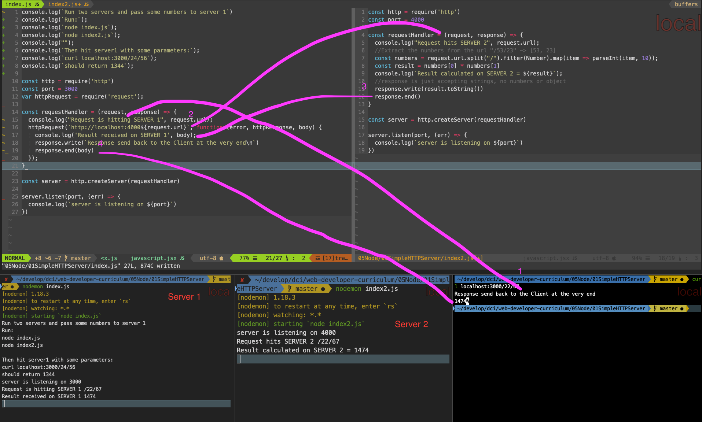

# Perform calculations by using TWO servers

Create a http server (localhost:3000) that makes a `request` to another http server (localhost:4000). The second server should respond to the first.
If you make a request to #1 with two numbers as url parameters (`curl localhost:3000/4/5`), it calls server #2, which calculates two numbers (4 * 5) and responds the result (20) to server #1 and returns the result (20) in the client. 

- Make request to localhost:3000
- Server1 gets that request and makes another request to server2
- Server2 calculates stuff and responds to Server1
- Server1 responds with the response to the client
- Just use `http` and `request` module.

Example in the screenshot 1. 2. 3. 4.:

